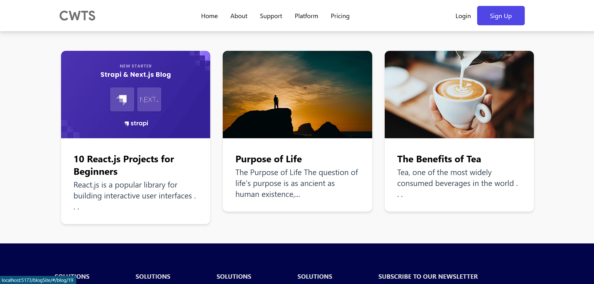
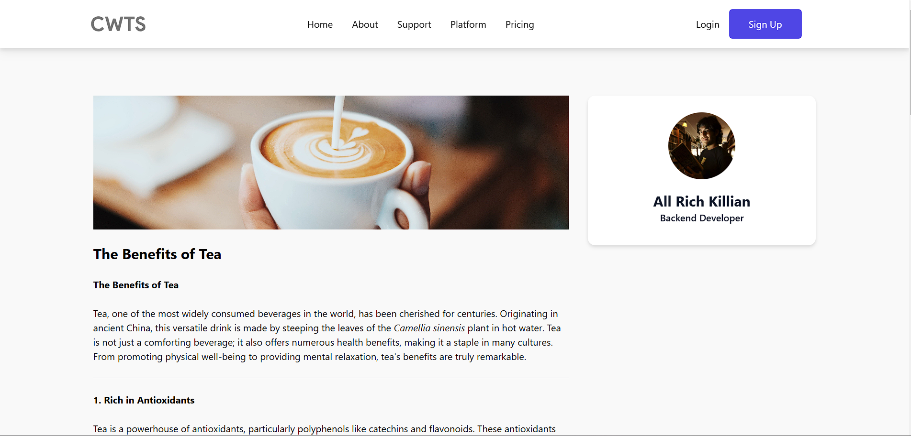

# Blog App

This is a blog application built using React, Vite, and Strapi.io as the backend SaaS platform. The app leverages React Router for navigation and Strapi as a headless CMS to manage and serve blog content.

<div style="display: flex; gap: 10px; flex-wrap: wrap;">
  
  
</

## Features

- **React-Vite Frontend**: A fast and efficient frontend built with React and Vite for quick development and hot-reloading.
- **Strapi.io CMS**: Uses Strapi as a headless CMS to manage blog posts and content.
- **React Router**: Implements React Router for easy navigation between pages like home, post details, and others.
- **Responsive Design**: The app is fully responsive and works well on various screen sizes.

## Tech Stack

- **Frontend**:
  - React.js
  - Vite
  - React Router
- **Backend**:
  - Strapi.io (Headless CMS)
- **Database**:
  - Strapi uses an in-built SQLite or PostgreSQL database (configurable).

## Installation

1. **Clone the repository**:

   ```bash
   git clone https://github.com/<Your-Username>/blogSite.git

   ```

2. **Install dependencies for the frontend:**

   ```bash
   npm install

   ```

3. **Set up Strapi:**

   - **Follow the [Strapi documentation](https://docs.strapi.io/dev-docs/intro) to set up Strapi as your CMS. You’ll need to configure the backend and create the necessary content types for blogs.**

4. **Start the frontend:**

   ```bash
   npm run dev

   ```

5. **Start the Strapi server:**

   ```bash
   cd <strapi-folder-path>
   npm run develop

   ```

6. **Open the Browser and nevigate to <code>http://localhost:3000</code> for the frontend and <code>http://localhost:1337/admin</code> to access the Strapi admin panel.**
